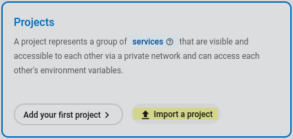

As our code base grew there was an urgent need for a place where we could gather our knowledge about the system. There are complicated processes in [Zerops](https://contabo.com/en/zerops/) and not everyone has the right information to carry them out.

We already had  a wiki on Redmine, but we wanted something more modern, with good support for editing and markdown out of the box. After some research we ended up choosing [Outline](https://www.getoutline.com/), partly because it is written in a high-available way. This makes Outline a great service to run on Zerops.

We used Slack for authentication purposes, so this tutorial is focused on that, but there are more [authentication methods](https://app.getoutline.com/s/770a97da-13e5-401e-9f8a-37949c19f97e/doc/authentication-7ViKRmRY5o) available. First we needed to create a [Slack account](https://app.getoutline.com/s/770a97da-13e5-401e-9f8a-37949c19f97e/doc/slack-sgMujR8J9J) in order to have SLACK_KEY and SLACK_SECRET values associated with our Slack account.

### Requirements

To host Outline we need following technologies.

* PostgreSQL (v12+)
* Redis (v4+)
* S3 compatible object storage
* Node.js (v16+)

We have created a Zerops recipe for your convenience. If you want to quickly import this project, here it is.

```yaml
project:
  name: outline-wiki
  tags:
    - wiki
services:
  - hostname: wiki
    buildFromGit: https://github.com/outline/outline
    pipelineConfig:
      wiki:
        build:
          base: [ nodejs@16 ]
          build:
            - yarn install --frozen-lockfile
            - yarn build
            - yarn sequelize db:create --env=production-ssl-disabled || true #skip creating db if already created
            - yarn sequelize db:migrate --env=production-ssl-disabled
          deploy: [ . ]	
          cache: [ node_modules ]
        run:
          init: 
            - zcli bucket s3 create s3 outline --x-amz-acl=private
          start: yarn start
    type: nodejs@16
    enableSubdomain: true
    envVariables:
      AWS_ACCESS_KEY_ID: ${s3_accessKeyId}
      AWS_REGION: us-east-1
      AWS_S3_UPLOAD_BUCKET_NAME: ${s3_serviceId|lower}.outline
      AWS_S3_UPLOAD_BUCKET_URL: https://zerops-usc1.contabostorage.com
      AWS_SECRET_ACCESS_KEY: ${s3_secretAccessKey}
      DATABASE_URL: postgres://db:${db_password}@db:5432/outline
      DATABASE_URL_TEST: postgres://db:${db_password}@db:5432/outline-test
      PGSSLMODE: disable
      REDIS_URL: redis://redis:6379
      SECRET_KEY: <insert-secret-key>
      UTILS_SECRET: <insert-util-secret-key>
      SLACK_CLIENT_ID: <insert-slack-id>
      SLACK_CLIENT_SECRET: <insert-slack-secret>
      URL: ${zeropsSubdomain}
    ports:
      - port: 3000
        httpSupport: true
    verticalAutoscaling:
      minVCpu: 1
      maxVCpu: 20
      minRam: 1.25
      maxRam: 32
      minDisk: 1
      maxDisk: 100
    minContainers: 1
    maxContainers: 4
    priority: 5
  - hostname: s3
    type: object-storage
    objectStorageSize: 2
    priority: 10
  - hostname: redis
    type: keydb@6
    mode: NON_HA
    priority: 10
  - hostname: db
    type: postgresql@12
    mode: HA
    priority: 10
```

This recipe creates 4 services, corresponding to 4 applications listed in the requirements section.

### Wiki service (Node.js)

Everything except the Node.js service is using a default configuration, so we’re going to describe how it’s configured in this section.

First we need to tell Zerops where to find the project's source code. We do that by using `buildFromGit` key.  By default, Zerops expects `zerops.yml` file in the root of the project directory. But we want to build a project from a repository that we don’t have write access to. To do that, we can specify a `zerops.yml` file’s content in the `pipelineConfig` attribute.

#### zerops.yml content in pipelineConfig

Now we're going to describe the content of the `pipelineConfig`. To build Outline we need `Node.js` and `yarn` installed. They are available in the `nodejs@16` build image.

In the build section we define necessary build steps which are copied from the [Outline documentation](https://app.getoutline.com/s/770a97da-13e5-401e-9f8a-37949c19f97e/doc/from-source-BlBxrNzMIP#h-installation). We cache the `node_modules` folder, to make additional builds faster.

In the `init` section we need to create a bucket for Outline to save assets. [ZCli](github.com/zeropsio/zcli) can be used to automate this process, by running `zcli bucket s3 create s3_hostname bucket_name`. It creates a new `bucket` prefixed with the s3 service id. We can find the service id in the environment variable `s3_serviceId`. It is going to be useful in the next section when we set the environment variables.

#### Configuration using environment variables

Outline is cloud-ready so it is pretty straight-forward to make it work with Zerops. Let’s break down the configuration of S3.

```yaml
AWS_ACCESS_KEY_ID: ${s3_accessKeyId}
AWS_REGION: us-east-1
AWS_S3_UPLOAD_BUCKET_NAME: ${s3_serviceId|lower}.outline
AWS_S3_UPLOAD_BUCKET_URL: https://zerops-usc1.contabostorage.com
```

If the object storage service is named `s3` and the bucket created using `zcli` is called `outline`, then there’s nothing to change. Next we need to configure database connections both for the `redis` and `postgresql`. `PGSSLMODE` is disabled, because the whole project is on its own private network and we do not communicate with the database over the Internet.

```yaml
DATABASE_URL: postgres://db:${db_password}@db:5432/outline
DATABASE_URL_TEST: postgres://db:${db_password}@db:5432/outline-test
PGSSLMODE: disable
REDIS_URL: redis://redis:6379
```

For signing in purposes, Outline uses 2 secrets. They can be configured using environment variables `UTILS_SECRET` and `SECRET_KEY`. To generate these keys, you can use this command from the terminal.

```sh
openssl rand -hex 32
```

Login and password authentication is currently not supported by Outline and so it needs to be integrated with a third party application like Slack. After creating an application as mentioned at the start of the article, you can configure Slack using the following environment variables.

```yaml
SLACK_CLIENT_ID: <insert-slack-id>
SLACK_CLIENT_SECRET: <insert-slack-secret>
```

Finally we need to configure the `url`, which Outline will be hosted on. If we want to use a Zerops subdomain we can leave the `URL` variable unchanged. Otherwise, we need to configure public access in the Zerops GUI and input the configured `url` here.

#### Configuration of ports

On `yarn start` Outline starts the application on port `3000`. The application uses `http` protocol, so we need to set `httpSupport` to `true`.

### Importing the project

You can import the project in the GUI using the following button.



After a successful import you can access the wiki using the configured `url` or the `zerops subdomain`, found in the `wiki` service.

### Conclusion

So that’s everything you need to run a self-hosted knowledge base on the Zerops platform. Outline is a really great piece of software and is cloud ready, so it fits nicely into the Zerops ecosystem.

If you have any further questions about the setup or about Zerops in general, feel free to ask for advice in our [community discord](https://discord.com/invite/WDvCZ54).
